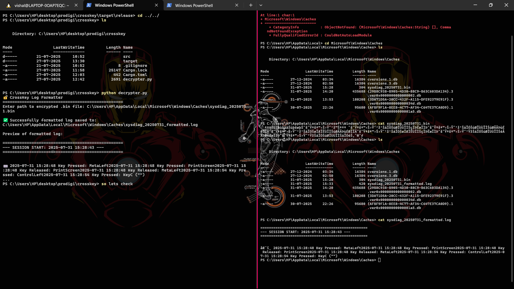
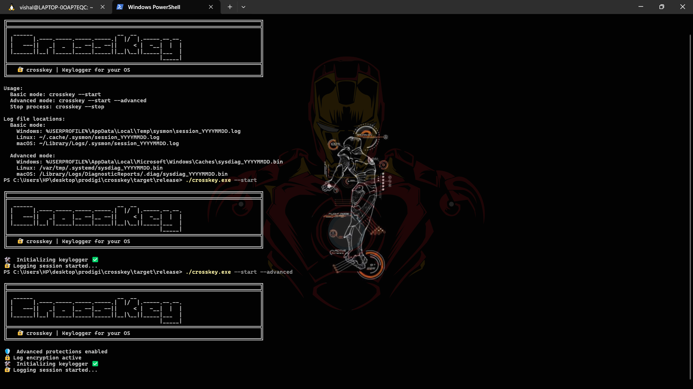

# CROSSKEY

**CROSSKEY** is a Rust-based keylogger tool designed for **educational and ethical security testing purposes**. It captures keystrokes and logs them to an **encrypted file**. A companion Python script `decrypter.py` is provided to **decrypt the log file** for analysis.

> ⚠️ **Important:** This tool is intended for ethical and legal use **only**, such as authorized security testing or educational purposes. **Unauthorized use of keyloggers is illegal and unethical**. Always obtain **explicit permission** from the system owner before using CROSSKEY.

---

## ✨ Features

- ✅ Captures and logs keystrokes securely
- 🔐 Encrypts logs to protect sensitive data
- 🐍 Includes a Python script (`decrypter.py`) to decrypt logs
- 💻 Cross-platform compatibility (Windows, Linux, macOS)

---

## 📸 Screenshots


### 🛠️ Setup Screenshot


### 🧪 Tool Usage


### 🔓 Decrypter Output


---

## 🧰 Prerequisites

Ensure the following are installed on your system:

- [Rust & Cargo](https://www.rust-lang.org/tools/install) (version `1.65` or later)

You can verify installation by running:

```bash
rustc --version
cargo --version
 ```


## 🚀 Installation

### 1. Clone the Repository

```bash
git clone https://github.com/rout369/PRODIGY_CS_04.git
cd src
```
### 2. Verify Rust and Cargo Installation

Check if Rust and Cargo are installed:
```bash
rustc --version
cargo --version
```
### 3. Create a New Rust Project

Create a new Rust project named crosskey(anywhere as your wish):
```bash
cargo new crosskey
cd crosskey
```
### 4. Replace main.rs Content
Navigate to crosskey/src/, delete the contents of main.rs, and copy the contents of PRODIGY_CS_04/src/keylogger.rs from the downloaded repository or zip file into main.rs:

```bash
cp ../PRODIGY_CS_04/src/keylogger.rs src/main.rs
```
or mannaully you can copy paste it...

### 5. Update Cargo.toml

Delete the contents of crosskey/Cargo.toml and replace them with the contents of PRODIGY_CS_04/Cargo.toml from the downloaded repository or zip file:

```bash
cp ../PRODIGY_CS_04/Cargo.toml .Cargo.toml
```
or mannaully you can copy paste it...

### 6. Build the Project
 Build the tool in release mode:

```bash
cargo build --release
```
This creates a binary in the target/release/ directory.

### 7. Run the Tool
Navigate to the release directory and run the tool with the help flag to see usage instructions:
```bash
cd target/release
./crosskey.exe --help
```

## 🧪 Usage

Run the keylogger from the target/release/ directory:
```bash
./crosskey.exe [OPTIONS]
```
### Example 
```bash
./crosskey.exe --start
```
Run ./crosskey.exe --help for a full list of options and commands.


## 🔓 Decrypting Logs
To read the encrypted log file, use the provided decrypter.py script:

### 1. Copy the Decrypter Script
Copy decrypter.py from the PRODIGY_CS_04/ directory to your working directory:
```bash
cp ../PRODIGY_CS_04/decrypter.py .
```
### 2. Run the Decrypter Script
Use Python to decrypt the log file:
```bash
python3 decrypter.py
```
after this it ask the file path give it the full file path and press enter  


